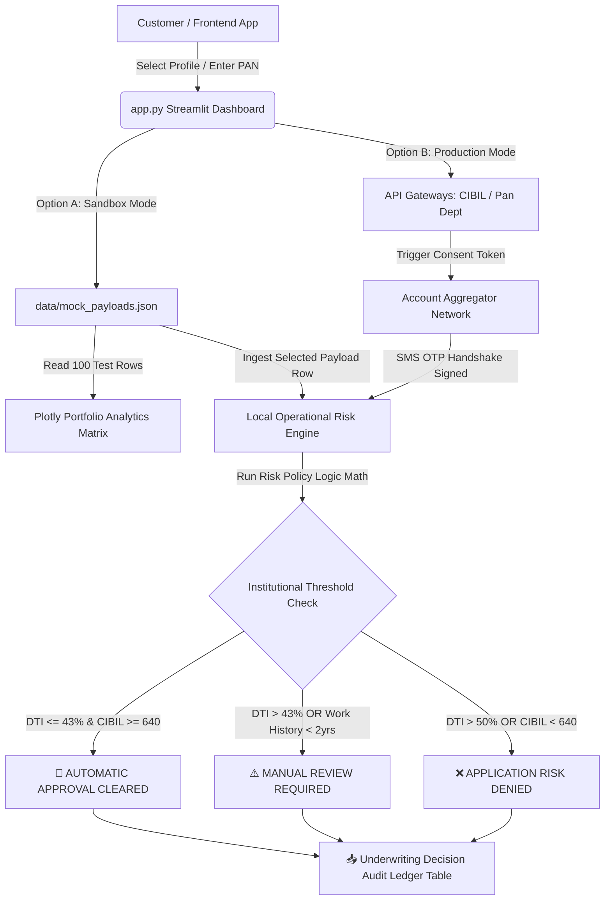

# 🏦 Automated Real-Time Loan Underwriter Dashboard

A lightweight, high-performance financial technology dashboard built with **Streamlit**, **Pandas**, and **Plotly**. This application automates institutional loan underwriting workflows by calculating risk metrics like the Debt-to-Income (DTI) ratio, parsing credit bureau indicators, and rendering deterministic credit scoring verdicts instantly.

---

## 🏗️ System Architecture & Data Flow

The system operates via two distinct environmental configurations. The architecture below outlines how data streams from input to the final algorithmic decision engine.



---

## ⚙️ Core Processing Pipeline Environments

### 📊 Option A: Mock Developer Data Testing (Free Sandbox)
* **Description:** Ideal for local testing, offline evaluation, and validating core underwriting risk structures.
* **Mechanism:** Reads a generated array database containing **100 historical customer records** from `data/mock_payloads.json`. 
* **Analytics Feature:** Compiles all 100 records instantly to output portfolio average metrics cards and a responsive **Plotly Scatter Plot Matrix** mapping CIBIL scores against DTI ratios relative to automatic risk limits. 
* **OTP Required:** **No.** Bypasses live security layers for rapid playground testing.

### 🌐 Option B: Production API-Driven Integration (Live OTP Required)
* **Description:** The structural pathway mapped for live deployment where customers enter details directly.
* **Mechanism:** Bypasses manual physical document collection (like salary letters or ID printouts). Instead, it maps out a programmatic data pipeline where entering a **10-digit PAN number** queries integrated credit bureau networks (CIBIL/Experian).
* **Consent Architecture:** Triggers a cryptographic query to the **RBI Account Aggregator Network**, safely collecting financial bank statements directly from institutional database arrays once the applicant authorizes transmission using a secure **SMS OTP code** sent to their cell phone.

---

## 📂 Repository Tree Layout

```text
loan-ai-underwriter/
│
├── data/
│   ├── mock_payloads.json      # In-memory database holding 100 unique testing rows
│   └── prompt_template.txt     # Institutional underwriting policy rules template
│
├── app.py                      # Core Streamlit Web Application interface orchestrator
├── README.md                   # System configuration, architecture maps, and documentation
└── requirements.txt            # Python environments package version declarations
```

---

## 🛡️ Institutional Policy Rules Engine

The local evaluation logic enforces rigid banking thresholds to eliminate default threats:
1. **Debt-to-Income (DTI) Ceilings:** 
   * **Under 43%:** Eligible for automatic approval.
   * **43% to 50%:** Bypasses automatic tiers and routes to `REFER` for manual human evaluation.
   * **Over 50%:** Triggers a structural `DENY` due to excessive leverage.
2. **Credit Rating Limits (CIBIL Score):**
   * **720+ (Prime Tier):** Receives best-tier pricing rate structures (**10.50%** fixed interest).
   * **640 - 719 (Near-Prime Tier):** Receives normal tier pricing structures (**12.75%** fixed interest).
   * **Below 640 (Subprime Tier):** Automatically triggers a strict application `DENY`.
3. **Employment Stability:** Minimum **2 years** of continuous income history is required. Failure shifts the applicant status immediately to a manual credit desk review tracker (`REFER`).

---

## 🚀 Local Installation & Deployment Guide

To install the environment and spin up the dashboard playground server on your local machine, follow these steps sequentially:

### 1. Clone the Workspace Files
Create your root directory path, move inside the workspace terminal, and ensure your repository matching structure matches the tree template:
```bash
cd loan-ai-underwriter
```

### 2. Standardize Package Installations
Use pip to pull down all necessary mathematical calculation packages and frontend plotting frameworks defined in your configuration:
```bash
pip install -r requirements.txt
```

### 3. Initialize the Streamlit Server
Boot up your dynamic local web application script directly from your terminal console panel:
```bash
streamlit run app.py
```
This instantly launches your live local interactive webpage grid environment at `http://localhost:8501`.

---

## 📄 Core Dependency Requirements (`requirements.txt`)
The framework runs efficiently on lightweight, stable data science tools without complex third-party AI platform SDK layers:
```text
streamlit>=1.30.0
pandas>=2.0.0
plotly>=5.18.0
requests>=2.31.0
```
