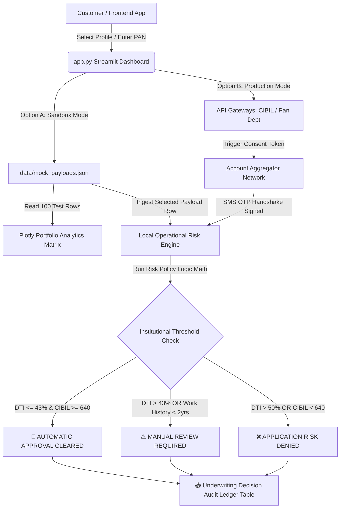

# 🏦 Automated Real-Time Loan Underwriter Dashboard

<p align="left">
  
  
  
</p>
**Automate institutional credit decisioning and compliance reporting in under 60 seconds.**

A lightweight, high-performance financial technology dashboard built with **Streamlit**, **Pandas**, and **Plotly**. This application automates institutional loan underwriting workflows by calculating risk metrics like the Debt-to-Income (DTI) ratio, parsing credit bureau indicators, and rendering deterministic credit scoring verdicts instantly alongside an LLM compliance audit.

---

## 🎯 Core Value & Features
* **Zero Paperwork:** Programmatic data pipeline using a 10-digit PAN number to query credit bureau networks (CIBIL/Experian).
* **Instant Risk Analytics:** Compiles historical developer arrays into live portfolio data metrics and interactive **Plotly Scatter Plot Matrices** tracking CIBIL vs. DTI boundaries.
* **Consent Architecture:** Integrates with the **RBI Account Aggregator Network** for safe, direct retrieval of financial bank statements via a secure **SMS OTP code** handshake.
* **Hardcoded Risk Safety Limits:** Automatically filters applications against rigid institutional banking policies, instantly routing applications into `APPROVE`, `DENY`, or manual `REFER` pipelines.
* **Dual-Compliance Reporting:** Instantly compiles local rules engine math and Groq AI audit responses into exportable **Plaintext Audit Logs (.TXT)** and styled **Executive Certificates (.PDF)**.

---

## 🚀 Quick Start (Launch Sandbox in 2 Minutes)

Test the entire workflow offline using the pre-loaded **100-record developer testing sandbox database** without requiring any live API credentials.

### 1. Clone & Navigate
```bash
git clone https://github.com
cd loan-ai-underwriter
```

### 2. Standardize Package Installations
```bash
pip install -r requirements.txt
```

### 3. Initialize the Streamlit Server
```bash
streamlit run app.py
```
Your dynamic local interactive webpage grid environment will immediately boot up at **`http://localhost:8501`**.

---

## 🏗️ System Architecture & Data Flow

The system operates via two distinct environmental configurations. The architecture below outlines how data streams from input to the final algorithmic decision engine.



---

## ⚙️ Processing Pipeline Environments

### 📊 Option A: Mock Developer Data Testing (Free Sandbox)
* **Description:** Ideal for local testing, offline evaluation, and validating core underwriting risk structures.
* **Mechanism:** Reads a generated array database containing **100 historical customer records** from `data/mock_payloads.json`. 
* **OTP Required:** **No.** Bypasses live security layers for rapid playground testing.

### 🌐 Option B: Production API-Driven Integration (Live OTP Required)
* **Description:** The structural pathway mapped for live deployment where customers enter details directly.
* **Mechanism:** Bypasses manual physical document collection (like salary letters or ID printouts) by mapping out a programmatic data pipeline via bureau networks.
* **Consent Framework:** Triggers a cryptographic query to the Account Aggregator Network once the applicant authorizes transmission using a cell phone OTP.

---

## 🤖 Hybrid Dual-Audit Core Engine

The underwriting layout runs a synchronized checking framework to maximize institutional compliance accuracy:

1. **Deterministic Local Formula Check:** Hardcoded Python functions run verification math against static banking constants.
2. **Autonomous Cognitive LLM Validation:** Streams the live data payload into the **Groq AI Engine** running advanced analytical neural models (`llama-3.3-70b-versatile`, `qwen`, etc.) to spot multi-layered data anomalies and fraud risks.

---

## 🛡️ Institutional Policy Rules Engine

The local evaluation logic enforces rigid banking thresholds to eliminate default threats:

| Evaluation Metric | Elite Target (Auto-Approve) | Borderline Target (Manual Review) | Subprime Target (Auto-Deny) |
| :--- | :--- | :--- | :--- |
| **CIBIL Credit Score** | **720+** *(Unlocks 10.50% Fixed Interest)* | **640 - 719** *(Unlocks 12.75% Fixed Interest)* | **Below 640** *(Immediate System Reject)* |
| **Debt-to-Income (DTI)** | **Under 43%** | **43% to 50%** | **Over 50%** *(Excessive Financial Leverage)* |
| **Employment Stability**| **2+ Years** continuous income | **Under 2 Years** *(Routes to human desk)* | N/A |

---

## 📂 Repository Tree Layout

```text
loan-ai-underwriter/
│
├── data/
│   ├── mock_payloads.json      # In-memory database holding 100 unique testing rows
│   └── prompt_template.txt     # Institutional underwriting policy rules template
│
├── app.py                      # Core Streamlit Web Application interface orchestrator
├── README.md                   # System configuration, architecture maps, and documentation
└── requirements.txt            # Python environments package version declarations
```

---

## 📄 Core Dependency Requirements (`requirements.txt`)
The framework runs efficiently on lightweight, stable data science tools and native standard generation libraries:
```text
streamlit>=1.30.0
pandas>=2.0.0
plotly>=5.18.0
requests>=2.31.0
groq>=0.4.0
reportlab>=4.0.0
```
